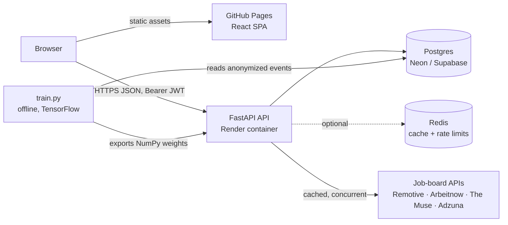
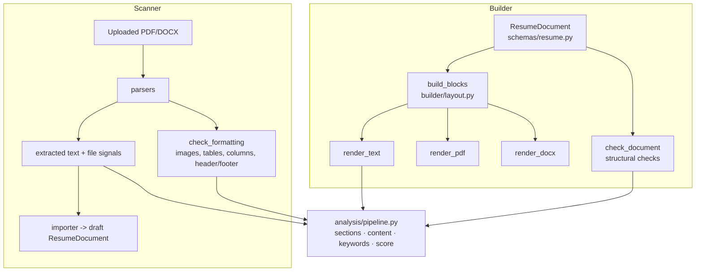
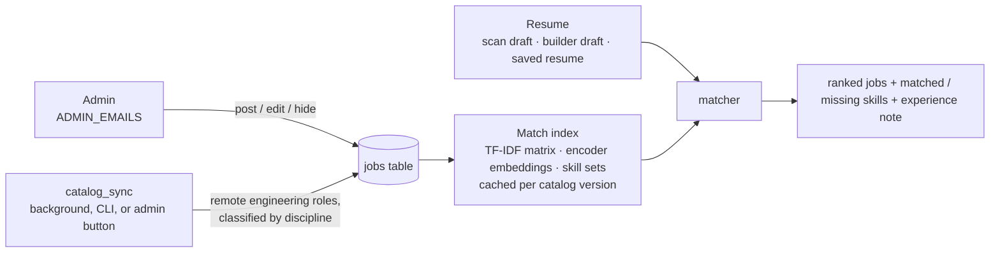
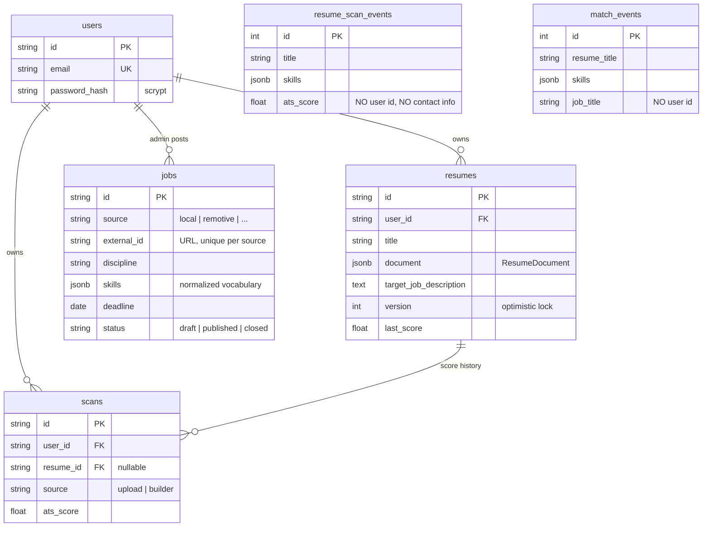

# Architecture

ATS Resume Scanner + Builder + Job Board. Version 2 turns the scanner
prototype into a product that scales: scan an existing resume, open it in a
structured builder, fix it against a live ATS score, export an ATS-safe
PDF/DOCX, optionally save versions to an account, and browse engineering and
data jobs ranked by how well the resume fits each one.

This document is the reference for how the system is put together, why, and
what changes as load grows. Code paths are relative to the repo root.

---

## 1. Goals and non-goals

**Goals**

- **One scoring engine for both products.** A resume built in the editor, then
  exported and re-uploaded, gets the same content and keyword score it showed
  live. This is enforced by tests, not by convention.
- **Runs on $0 today and scales without a rewrite.** Every component that
  would need to change under load sits behind a single seam. Scaling is
  configuration plus one swapped function.
- **Privacy by construction.** Uploaded files are processed in memory and never
  written anywhere. Analytics are anonymized at the point of capture. Account
  data is deleted with the account.
- **Accounts are optional.** Scanning, building, live scoring and export all
  work anonymously. An account only adds saving and syncing.

**Non-goals (for now)**

- LLM rewriting of bullets. The score is rule-based and explainable on
  purpose: every point lost maps to a sentence telling the user how to win it
  back.
- Making or influencing hiring decisions. See
  [`MODEL_CARD.md`](backend/app/matching/MODEL_CARD.md).

---

## 2. System context



| Piece | Tech | Hosted on (free tier) | State |
|---|---|---|---|
| Frontend | React 18, Vite, React Router (hash routing) | GitHub Pages | Draft in `localStorage` for anonymous users |
| API | FastAPI, Uvicorn, SQLAlchemy 2, Alembic | Render (Docker) | **Stateless** |
| Database | Postgres 16 (SQLite in dev and tests) | Neon or Supabase | Users, resumes, scans, anonymized events |
| Cache | In-process `MemoryCache`, or Redis when `REDIS_URL` is set | n/a, or Upstash | Job-board responses, rate-limit counters, stats |
| Matching model | Keras for training, pure NumPy for inference | Bundled in the API image | Read-only artifacts |

---

## 3. Backend layout

```
backend/
  app/
    main.py                 app factory: middleware, lifespan, routers
    core/                   cross-cutting, no domain logic
      config.py             every setting, env-driven, validated
      security.py           scrypt password hashing, JWT
      cache.py              Cache protocol: MemoryCache | RedisCache
      rate_limit.py         per-IP fixed-window limits on the cache
      executor.py           THE seam for CPU-bound work (see §6)
      logging.py            request IDs, structured logs, JSON 500s
    db/                     models.py (schema), session.py (engine), scans.py
    api/
      deps.py               DB session, optional/required current user
      routes/               health · auth · analyze · builder · resumes · jobs · admin
    schemas/                Pydantic contracts (resume.py is the core model)
    parsers/                PDF/DOCX -> text + structural signals
    analysis/               scoring engine; pipeline.py is the single entry point
    builder/                layout -> text/PDF/DOCX, structural checks, importer
    jobs/                   job-API providers + live search aggregator, and the
                            job board: taxonomy, catalog, catalog_sync, matcher
    matching/               encoder inference, anonymized event store, training
  alembic/                  migrations (0001_initial_schema)
  tests/                    ~80 tests, runnable against SQLite or Postgres
```

Dependency direction: `api → (analysis | builder | jobs | matching) → (parsers | schemas | db) → core`.
Nothing in `core/` imports from a domain package.

---

## 4. The central idea: one layout, one scorer



- `build_blocks()` is the only place that decides what a built resume says and
  in what order. The live score, the PDF, the DOCX and the in-browser preview
  (`frontend/src/builder/model.js`, a line-for-line mirror) all consume it.
- The scorer has one input slot for "formatting". Uploads fill it with file-level
  risks (images, tables, multi-column, header/footer contact info). Built
  resumes can't have those, because the layout is single-column text by
  construction, so the slot holds structural checks instead: missing contact
  details, roles without dates or bullets, overlong bullets.
- `tests/test_builder.py::test_exported_files_are_ats_clean_and_score_like_the_editor`
  exports to both formats, parses the files back with the scanner, and asserts
  zero formatting issues, all sections detected, and identical content and
  keyword scores.
- `test_export_then_import_roundtrip_is_lossless` closes the loop:
  builder → PDF → scanner → importer reproduces the original document.

---

## 5. Request flows

**Scan (`POST /api/analyze`, anonymous or signed in)**

1. Rate limit, extension check, then read at most `MAX_UPLOAD_MB + 1` bytes, so
   an oversized body is never fully buffered.
2. `executor.run_cpu_bound(parse_upload → analyze_parsed → document_from_text)`:
   - Magic bytes must match the extension.
   - The PDF page count is checked before any per-page work.
3. Respond with the analysis plus a `draft_document` for "Open in builder".
4. After the response is sent (`BackgroundTasks`), write an anonymized
   `resume_scan_events` row. If signed in, also write a `scans` history row.

**Live score (`POST /api/builder/score`)**

The frontend debounces edits by 700 ms and aborts any in-flight request
(`useLiveScore.js`). The server is stateless: the document travels in the
body, so anonymous users get the same feature. Cost is about 6 ms per call.

**Export (`POST /api/builder/export/{pdf|docx}`)**

Stateless. The filename is sanitized server-side.

**Save (`PUT /api/resumes/{id}`)**

Optimistic concurrency, enforced in a single statement:
`UPDATE … WHERE id=? AND user_id=? AND version=?`. Zero affected rows means
another tab or device saved first. The API returns 409 and the UI offers
"Load latest". A score-history row is written only when the score changed.

**Job search (`POST /api/jobs/search`)**

The four providers are fanned out concurrently over one pooled `httpx` client,
under an overall deadline (`JOBS_SEARCH_TIMEOUT_SECONDS`):

- **Caching:**
  - Per-query providers (Remotive, Adzuna) are cached per normalized query.
  - Whole-feed providers (Arbeitnow, The Muse) are cached as one feed and
    filtered locally, so N searches cost one download per TTL.
  - Empty or failed responses are never cached, so an outage isn't pinned for
    15 minutes.
- **Failure handling:** each provider swallows its own failures, so a broken
  job board degrades the results but never fails the request.
- **Ranking:** keyword/title overlap, plus NumPy-encoder similarity.


**Job board (`GET /api/jobs`, `POST /api/jobs/match`, `/api/admin/jobs`)**



- **Five disciplines** (`jobs/taxonomy.py`): Data & Analytics, Software & IT,
  Civil & Construction, Electrical & Electronics, and Mechanical, Industrial &
  Textile.
  - Classification uses ordered keyword rules on the title, so "Data Engineer"
    is Data and "Electrical Maintenance Engineer" is Electrical.
  - For a candidate, signature skills break ties when the title is vague.
  - Non-engineering roles return `None` and never enter the catalog.
- **Two sources, one table.**
  - Local listings are posted by admins. Admins exist only through the
    `ADMIN_EMAILS` env var, so nobody can grant themselves admin through the
    API.
  - Remote roles are imported from the public APIs, upserted by
    (source, URL), and kept only if they're remote. An on-site job in Berlin
    is noise for a candidate in Dhaka.
  - Imported jobs age out after `JOBS_EXTERNAL_MAX_AGE_DAYS` without being
    seen. A job an admin hid stays hidden across re-imports.
- **Sync never blocks a request.** When the catalog is read and the last import
  is older than `JOBS_SYNC_INTERVAL_HOURS`, a background task starts. A cache
  lock ensures one sync per lock window, and the staleness check itself is
  cached.
- **Matching:**
  - Each job scores 0–100 from four parts:

    | Component | Weight |
    |---|---|
    | Skill overlap (denominator capped at 12) | 0.50 |
    | TF-IDF text similarity | 0.25 |
    | Encoder similarity | 0.15 |
    | Experience fit | 0.10 |

  - **Cost per request:** the job side (TF-IDF matrix, embeddings, skill sets)
    is built once per catalog version, keyed on count, `max(updated_at)` and
    today's date. A match request then costs one resume vectorization plus a
    dot product per job, not a model fit.
  - **Privacy:** the resume travels in the request body and isn't stored.

---

## 6. Scaling model

### What makes one instance efficient

| Concern | Mechanism |
|---|---|
| Event loop never blocked by parsing | CPU work runs in worker threads via `core/executor.py` |
| Memory bounded under bursts | Semaphore of `PARSE_CONCURRENCY` (default 4) concurrent parses; page and size limits |
| External API cost | Shared cache with TTL; one pooled HTTP client per process |
| User-facing latency | Analytics and history writes happen after the response |
| Abuse | Per-IP rate limits per endpoint family; input size caps in the Pydantic schemas |
| DB connections on serverless Postgres | `pool_pre_ping`, `pool_recycle=300`, small pool (5 + 5 overflow) |
| Hot COUNT(*) on a public endpoint | `/api/stats` cached for 60 s |

### Measured costs

Single-threaded, on a 4-vCPU dev container. Divide accordingly for a
fractional-CPU free instance.

| Operation | p50 | p95 |
|---|---|---|
| Live score (`/builder/score`, with JD) | 6 ms | 7 ms |
| Upload scan, 1-page PDF (parse + analyze + import) | 49 ms | 62 ms |
| Upload scan, 2-page PDF | 168 ms | 340 ms |
| Export PDF | 161 ms | 235 ms |
| Export DOCX | 46 ms | 55 ms |

Peak Python heap for one 2-page scan was about 7 MB. That's why a
concurrency of 4 is safe inside a 512 MB container.

### The API is stateless, so it scales out horizontally

No request depends on which instance served the previous one:

- **Auth:** JWTs, so there are no server sessions.
- **Drafts:** live in the browser or in Postgres.
- **Uploads:** never touch disk.

The only per-process state is the cache, and §6.1 below covers that.

### Growth stages and their triggers

| Stage | When (measure, don't guess) | Change |
|---|---|---|
| **0: now** | Portfolio traffic | 1 Render instance, Neon Postgres, in-memory cache. Migrations run in `start.sh`. |
| **1: more than one instance** | Sustained CPU > 70 %, or p95 of `/api/analyze` > 2 s | Set `REDIS_URL` (Upstash free tier) so cache and rate limits are shared. Run migrations once per deploy (`RUN_MIGRATIONS=0` on web instances plus a pre-deploy job). Raise `WEB_CONCURRENCY` or the instance count. |
| **2: CPU-bound work dominates** | Parse/export time is the bulk of instance CPU, or uploads queue behind the semaphore | Replace the body of `executor.run_cpu_bound()` with a Redis-backed job queue (e.g. arq) and a separate worker service. Routes don't change. If p95 then exceeds about 5 s, switch `/api/analyze` to submit-and-poll (`202` plus a job id). |
| **2b: job catalog grows** | More than ~10k open jobs, or index rebuilds show up in p95 | Run `python -m app.jobs.sync` on a schedule (cron) with `JOBS_SYNC_ENABLED=false` on web instances. Precompute job embeddings at write time into `pgvector` and pre-filter candidates by discipline and skills in SQL before scoring. |
| **3: data volume** | Event tables reach tens of millions of rows | Monthly partitioning or roll-ups of `*_events` with a retention job; a read replica for stats and training reads. |

Deliberately **not** in the architecture: object storage. Uploads are never
persisted, so there's nothing to store, and keeping it that way is cheaper
and safer than any bucket policy.

### Known hot spot

PDF export re-parses the DejaVu TTF on every call; most of the 160 ms is
font loading. If export volume grows, cache the parsed font, or pre-render the
static parts of each template.

---

## 7. Data model



- **`document` is JSONB, validated by Pydantic on the way in.** The resume
  schema evolves through `schema_version` without a migration per field.
  Relational columns are reserved for what's queried or constrained.
- **Two data classes:**
  - Account data cascades on delete (`DELETE /api/auth/me`).
  - Event rows carry no user id, so they can't be tied back to anyone. For
    uploads, `current_title` is trimmed to the title itself so the employer
    name doesn't leak in.
- **Migrations:** Alembic owns the schema. CI runs `alembic check` against
  Postgres to fail any model change that ships without a migration.

---

## 8. Security

| Threat | Control |
|---|---|
| Credential stuffing / brute force | `RATE_LIMIT_AUTH`. Uniform 401s, and a dummy hash check for unknown emails so response timing doesn't reveal which accounts exist. |
| Password theft from a DB leak | scrypt (N=2¹⁴, r=8, p=1) with a per-password salt; constant-time compare |
| Token forgery | HS256. `JWT_SECRET` if configured (32+ chars enforced); otherwise a random key generated once and stored in the database (`app_secrets`), so a deploy that forgot the env var is still secure — the public dev default is never used to sign. |
| Job-board abuse | Posting is admin-only (env-configured). Apply links must be `http(s)` or `mailto` (validated on the API, checked again in the UI) so a `javascript:` URL can't be planted; imported descriptions are stripped to plain text and rendered as text. |
| IDOR on resumes | Every query is scoped by `user_id`. Foreign resumes return 404, not 403. |
| Lost updates | Version compare-and-swap (409) |
| Malicious uploads | Extension *and* magic-byte checks; size cap read without buffering; page cap before parsing; parsing errors become 422 |
| Resource exhaustion | Parse semaphore, per-endpoint rate limits, list and string caps in the schemas, per-user resume quota |
| Cross-origin abuse | CORS allowlist (`ALLOWED_ORIGINS`), no credentialed CORS |
| Error leakage | Unhandled exceptions return a generic JSON 500 carrying `request_id`. The CORS layer wraps it, so browsers can still read it. |

**Trade-off: bearer token in `localStorage`, not an httpOnly cookie.** The SPA
(`github.io`) and API (`onrender.com`) are different sites, and browsers
increasingly block third-party cookies, so a cookie session wouldn't work
reliably. The cost is XSS exposure of the token. That's mitigated by React's
escaping, no `dangerouslySetInnerHTML`, and no third-party scripts beyond
Google Fonts CSS. Putting the API and SPA on one domain would allow moving to
`SameSite=Lax` cookies.

---

## 9. Frontend

```
frontend/src/
  main.jsx            HashRouter + AuthProvider
  App.jsx             layout + routes: / · /builder · /builder/:id · /resumes · /login
  api/client.js       one fetch wrapper: auth header, 401 -> sign-out, 429 -> Retry-After message
  auth/               AuthContext (token validated on load; network errors don't log you out)
  pages/              ScanPage · BuilderPage · ResumesPage · AuthPage
  builder/            model.js (document helpers + preview layout) · useLiveScore · editors · ScorePanel · ResumePreview
  components/         scanner result widgets (from v1) + NavBar
```

- **Hash routing:** GitHub Pages can't rewrite deep links to `index.html`, and
  `#/builder` survives a hard refresh.
- **Draft persistence:**
  - Anonymous drafts autosave to `localStorage`.
  - Saved resumes track a dirty snapshot, warn before unload, and save with
    Ctrl/⌘+S.
- **Bullet coaching:** the server's `flagged_lines` are matched back to the
  bullet that produced them, so the hint shows inline under that bullet.

---

## 10. Testing strategy

| Layer | What's covered | Where |
|---|---|---|
| Unit | Security, cache backends (memory and fakeredis), rate parsing, settings validation | `test_core.py` |
| Parsing | Multi-column detection on 5 layouts; DOCX list bullets; magic bytes; page cap | `test_parsers.py` |
| Builder | Layout text, checks, PDF/DOCX ATS-cleanliness, score parity, Unicode/fallback fonts, importer round-trip | `test_builder.py` |
| API | Auth, quotas, ownership isolation, version conflicts, uploads, rate limits, CORS, JSON 500s, job caching | `test_api_*.py` |
| Job board | Discipline classifier; admin permissions and validation; filters and facets; ranking (data and civil resumes each rank their own discipline first); experience gaps; index refresh; import filtering, upsert, hidden-job persistence, ageing out; background-sync lock | `test_job_board.py` |
| Migrations | Every test DB is built by `alembic upgrade head`; CI adds `alembic check` | `conftest.py`, CI |

The whole suite runs on SQLite by default and on Postgres when
`TEST_DATABASE_URL` is set; CI runs both. A Playwright pass covered the
browser flow end to end:

1. Upload a PDF and scan it.
2. Open it in the builder.
3. Edit; the live score rises.
4. Export PDF and DOCX.
5. Register and save to the account.
6. Hit a version conflict.
7. Check the mobile layout.

---

## 11. Decision log

| Decision | Alternatives | Why |
|---|---|---|
| Sync SQLAlchemy in a threadpool | Async SQLAlchemy | The CRUD-shaped workload doesn't benefit, and sync is simpler to test. The CPU-bound paths are the real bottleneck, and they're isolated in the executor. |
| Pydantic-validated JSONB for the resume | One table per section | The resume is always read and written whole, and the schema evolves through `schema_version` |
| Rule-based, explainable score | LLM grading | Deterministic, free, fast (6 ms), and every deduction has a fix attached |
| fpdf2 for PDF | WeasyPrint, headless Chrome | Pure Python with no system libraries. Real text output that the scanner itself can re-parse. |
| NumPy inference for the encoder | TensorFlow in production | Keeps a 500 MB dependency out of a 512 MB container |
| Cache/limits behind one interface | Redis from day one | $0 at one instance, one env var at two or more |
| Hash routing | History routing | GitHub Pages has no rewrite rules |

---

## 12. Known limitations

- **No permanent database until `DATABASE_URL` is set:** without it the API
  uses SQLite, which Render's free tier wipes on every restart. `/api/meta`
  reports this and the UI warns users on the account, saved-resume and admin
  pages instead of implying their data is safe.
- **Free-tier cold starts:** the first request after idle takes 30–50 s. The
  client tells the user the server may be waking up.
- **Importer:** heuristic, as resume formats vary widely. The UI asks users to
  review each field.
- **Fixed-window rate limits:** allow up to 2× the limit across a window
  boundary. Accepted for one cache round-trip per request.
- **Skills vocabulary:** curated (`analysis/skills_data.py`, now covering
  data, software, civil, electrical and mechanical/textile terms) and
  English-centric. Keyword matching outside it relies on TF-IDF similarity
  only.
- **Encoder on non-tech roles:** the matching encoder was trained on a
  tech-heavy job corpus. It rates two *different* non-tech disciplines (e.g.
  civil vs. textile) as fairly similar, which is why it gets only 15% of the
  match score while skill overlap and TF-IDF dominate. Retraining once the
  catalog holds local civil, electrical and textile postings will sharpen it.
- **A small local catalog to start:** admins post local listings by hand,
  so the board starts small. Imported remote roles fill software and data
  first; civil, electrical and textile depend mostly on admin posts.
